<div align="center">



**Analista de Dados · Business Intelligence · Automação e IA**
Sobral, CE — Híbrido/Remoto

[](https://linkedin.com/in/crislainegomesoliveira)
[](mailto:crislaingomez@gmail.com)

</div>

<br>

Transformo processos manuais e dados dispersos em dashboards, automações e sistemas que sustentam decisão. Atualmente na **GEX Consultoria**, mapeando processos AS IS → TO BE e construindo indicadores, CRMs e agentes de IA para pequenas e médias empresas.

## Experiência

| Período | Função | Empresa |
|---|---|---|
| jun 2026 — atual | Analista de Processos e Desenvolvedora de Soluções (freelancer) | GEX Consultoria |
| jan 2026 — jul 2026 | Assistente de Logística — Digital Commerce | Grendene S/A |
| fev 2026 — mai 2026 | Desenvolvedora de Sistemas e Integrações (freelancer) | GEX Consultoria |
| mai 2025 — out 2025 | Auxiliar Administrativo — CAF/OPME | Grupo MRH / FGV |
| mai 2024 — mai 2025 | Auxiliar de Logística e Farmácia — OPME | COAPH / ISGH |

## Destaque

**App de Controle de OPME**, desenvolvido em AppSheet e implantado em **6 hospitais do Ceará**, com reconhecimento institucional da Gerência de Assistência Farmacêutica e da Diretoria de Operações do ISGH.

## Stack

```
dados & bi        power bi · dax · power query · excel avançado
python & sql       python · pandas · sql server · mysql · postgresql · oracle
automação & ia     appsheet · apis · agentes de ia · n8n
desenvolvimento    typescript · react · supabase · vercel · git
sistemas           totvs protheus · fluig · gercomp · erp · tms
```

## Projetos selecionados

**[A/B Testing Analytics](https://github.com/crislaingomez-coder/ab-testing-analytics)**
Validação de dados, bootstrap e testes automatizados para experimentos A/B, com relatório executivo. `Python` `Pandas` `Pytest` `GitHub Actions`

**[Commerce Ops Intelligence](https://github.com/crislaingomez-coder/cgo-data-ops)**
Diagnóstico executivo de operações de e-commerce — SLA, frete, devoluções e score de risco. `Python` `Pandas` `Automação`

**[Dashboard Operacional de E-commerce](https://github.com/crislaingomez-coder/dashboard-ecommerce-grendene)**
Case apresentado no processo seletivo que resultou na contratação pela Grendene. `Power BI` `DAX` `Power Query`

**[Portfólio de Dashboards Power BI](https://github.com/crislaingomez-coder/portfolio-power-bi)**
Cinco dashboards — vendas, metas, inadimplência, clientes e desempenho semestral. `Power BI` `Excel`

**[App de Gestão Financeira](https://github.com/crislaingomez-coder/app-gestao-fin)**
PWA de controle financeiro pessoal, com autenticação e persistência de dados. `TypeScript` `React` `Supabase`

## Formação e certificações

**Análise e Desenvolvimento de Sistemas** — Descomplica Faculdade Digital *(em andamento, conclusão prevista abr 2028)*
**Técnico em Redes de Computadores** — EEEP Dom Walfrido Teixeira Vieira *(2015)*

Power BI Impressionador (118h) · Análise de Dados Impressionadora (117h) · Excel Impressionador (110h) · SQL Impressionador (90h) · Inteligência Artificial Impressionador (60h) · n8n Impressionador (22h) · Agentes de IA com Python — OpenAI, Hugging Face e LangChain (9h) — *Hashtag Treinamentos*

<br>

<div align="center">

[LinkedIn](https://linkedin.com/in/crislainegomesoliveira) · [GitHub](https://github.com/crislaingomez-coder) · [E-mail](mailto:crislaingomez@gmail.com)

</div>
